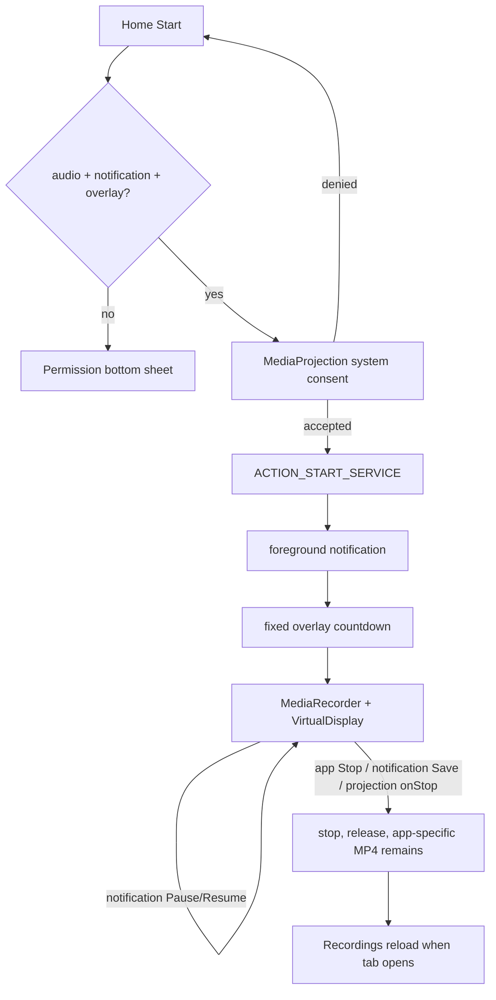

# User flows

## Principal flow

## Recording and permission sequences

| # / flow | Component → method/callback; state/action | Storage/result | Missing handling / device uncertainty |
|---|---|---|---|
| 1 First launch | `MainActivity.onCreate` initializes prefs/nav/ad; Home `onStart` binds (auto-creates) service; `setupUI` reads defaults | No file; Home defaults displayed | No onboarding. Binding creates service/channel before recording. Ad/network, theme and permission-sheet timing require testing. |
| 2 All permissions | Home click → `areAllPermissionsGranted` → `requestScreenRecordingPermission` | Await OS consent | Aggregate gate requires mic even if future audio-off intent; no preference controls audio. |
| 3 Mic missing | Start → `PermissionBottomSheetFragment.requestAudioPermission` | Recording blocked until grant | denial/permanent denial has no rationale/settings route. |
| 4 Notification missing (API 33+) | Sheet runtime launcher | Recording blocked | FGS may function without visible drawer notification depending OS behavior, but code blocks; test denial variants. |
| 5 Overlay missing | Sheet → `ACTION_MANAGE_OVERLAY_PERMISSION` | Recording blocked | return refresh only; broad overlay explanation/confidence requires UX test. |
| 6 Consent accepted | Home ActivityResult → `ServiceLauncher.startScreenRecordingService`, `ACTION_START_SERVICE` | button immediately says Stop; file later created in app Movies | Service startup exceptions not presented. |
| 7 Consent denied | ActivityResult else branch | No file/result | **Verified defect:** empty branch gives no feedback. |
| 8 Countdown | `startForegroundServiceWithNotification` → `showCountdownOverlay` | 3/2/1; capture starts afterward | setup navigation may be captured while user changes app; fixed duration; overlay failure uncaught. |
| 9 Started | `startScreenRecording`: projection callback, recorder, virtual display, `start`, callback/timer | `ScreenRecording<epoch>.mp4` in app external Movies | UI already said Stop before actual success; start failure only log/cleanup. |
| 10 Pause | notification `ACTION_PAUSE` → `pauseScreenRecording`; `isPaused=true`, accumulated time | Same MP4 | API/call-state exception uncaught; notification UI test. |
| 11 Resume | notification `ACTION_RESUME`; timer restarts | Same MP4 | multiple unscoped timer coroutine behavior needs testing. |
| 12 App stop | Home “Stop” → `ACTION_STOP_SERVICE` → `stopScreenRecording` | MP4 finalized, callback resets UI/timer if bound | release assumptions can crash after partial init; no saved confirmation/list push. |
| 13 Notification stop | “Save” → `ACTION_STOP` | Same as stop | Label falsely implies export; app callback absent when unbound. |
| 14 System stops projection | `MediaProjection.Callback.onStop` → stop | Attempts finalization | recursive `mediaProjection.stop()` and partial state behavior need testing. |

## Library/file flows

| Flow | Component/method/state | Result | Gaps / test need |
|---|---|---|---|
| Open Recordings | tab → `setupRecyclerView` → loading dialog → `MainViewModel.loadVideosFromFolder` | Lists app Movies `.mp4`, `.wav`, `.aac`, newest first; empty message | null directory never posts empty list; corrupt metadata becomes 0; first-visit storage message. |
| Play | item tap → options → `playMediaFile` | FileProvider `ACTION_VIEW`; supports exact lowercase mp4/aac | WAV is listed but unsupported; uppercase extensions listed but MIME switch is case-sensitive. |
| Export/save | Save to Folder checks stored URI; if valid `saveVideoToFolder`, else folder picker | SAF copy to chosen tree | Created name is `sourceFile.name + ".mp4"`, producing `.mp4.mp4`; picker selection does not continue original save. Large-copy progress/cancellation/space errors unhandled. |
| Share | `shareVideo` | FileProvider `ACTION_SEND video/*` chooser | AAC/WAV still labeled video; receiver limits/large files need testing. |
| Rename | dialog → `MainViewModel.renameVideo` | Adds `.mp4` unless supplied | Can turn AAC/WAV into MP4 without conversion; no sanitization/collision UI/failure Toast. |
| Delete one | confirmation → `deleteVideo` | Physical delete; list reload; result Toast | irreversible; no recovery. |
| Delete multiple | long press/tap selection → toolbar → confirmation → `deleteSelectedVideos` | Sequential deletes; always “success” event | return values ignored; partial failure presented as success (**verified defect**). |

## Settings actions

All begin in `SettingsScreenFragment.setupOtherSettingsCard`: Rate Us → market URI then web fallback; Share App → text chooser; Privacy → external browser (Toast if none); Report Bugs → mailto chooser (Toast if none); Version Info → display only; WhatsApp → code has an external community intent but its layout row is `gone`, so users cannot open it. External handler and offline outcomes require testing.
